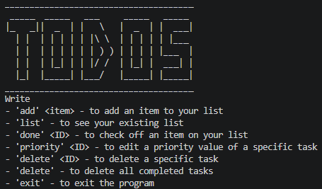
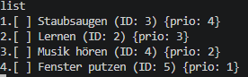
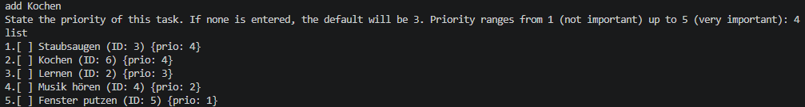
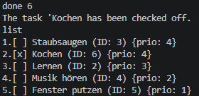
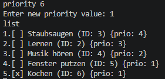
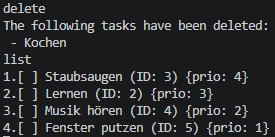
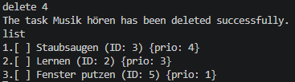

# TODO CLI Application in C++

## Description
This project is a command line application that allows you to create and manage your own TODO lists.

## Features
- add & delete tasks
- list tasks
- mark tasks as completed
- assign and edit priorities of tasks
- automatically sort tasks according to priority
- save TODO list as a file
- load previously saved TODO lists

## How to Build & Run
```bash
make
./todo
```

## Usage
An example TODO list is already provided in the output directory.
If you start with an empty directory, the program will create and manage your own TODO file automatically.

## Example

### Interface


### Listing tasks


### Adding a task (+list tasks)


### Check off a task (+list tasks)


### Edit a priority value (+list tasks)


### Delete all completed tasks (+list tasks)


### Delete a specific task (+list tasks)


## Notes
- a C++ compiler is required to run the program
- the program uses a makefile for compilation

## Target
This project was built to practice and improve C++ skills, especially File I/O, keeping a clean structure and error handling.
